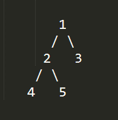

###二叉树基础知识
节点分为三种：根节点、左子节点、右子节点
后续分别以：根、左、右代替

各种遍历遵循的顺序

	先序遍历：根-->左-->右
	中序遍历：左-->根-->右
	后序遍历：左-->右-->根

例1：
	

		
	  先序遍历：1 2 3	  
	  中序遍历：2 1 3	  
	  后序遍历：2 3 1
  

例2：

  
	  
	  先序遍历： 1 2 4 5 3
	  中序遍历： 4 2 5 1 3
	  后序遍历： 4 5 2 3 1
	 
例3：

  
	  
	先序遍历：4 2 1 0 3 5 9 7 6 8
	中序遍历：0 1 2 3 4 5 6 7 8 9
	后序遍历：0 1 3 2 6 8 7 9 5 4
  
  
 在已知中序遍历与其他任何一种遍历结果的情况下，可以推算出二叉树的分布。
 所以，如何通过程序构建排序二叉树 ？
	
  